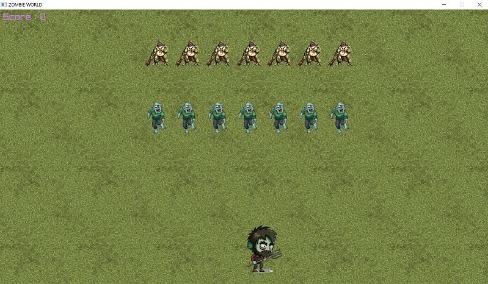

<h1>Projet C++</h1>

<h2>Présentation générale</h2>
Ce jeu est inspiré de Space Invaders. Vu du dessus, notre joueur doit tuer les ennemis qui arrivent par vagues. Il s'agit ici de zombies et de trolls.  
On a appelé notre jeu : **ZOMBIE WORLD**.

<h3>Pour Jouer</h3>
* Passer du menu principal au jeu : ``ENTREE``
* Déplacer le joueur (clavier Azerty)
  * ``D`` ou ``->`` : A droite
  * ``Q`` ou ``<-`` : A gauche
* Tirer sur les ennemies : ``ESPACE``
* Quitter la partie : ``ECHAP``

<h3>Illustration</h3>

***

<h2>Développement</h2>
<h3>Environnement</h3>
Nous avons utilisé l'IDE **Clion** de JetBrain, sur le système d'exploitation **Windows**.
  
<h3>Contributeurs</h3>
* Lucas Pinard (lucasP243)
* Amélie Guédès (MelyMelo8)
* Alexander Mazeres (AlexMaze1210)
* Nicolas Dos Santos (Nicolas-dos6)

***
<h2>Diagrammes UML</h2>
On a utilisé le logiciel Bouml pour faire ces diagrammes, par conséquent, il vaut mieux l'installer pour pouvoir ouvrir les fichiers de [UML-CppProject](UML-CppProject).

<h3>Diagramme de classes</h3>

<h3>Diagramme de séquence</h3>