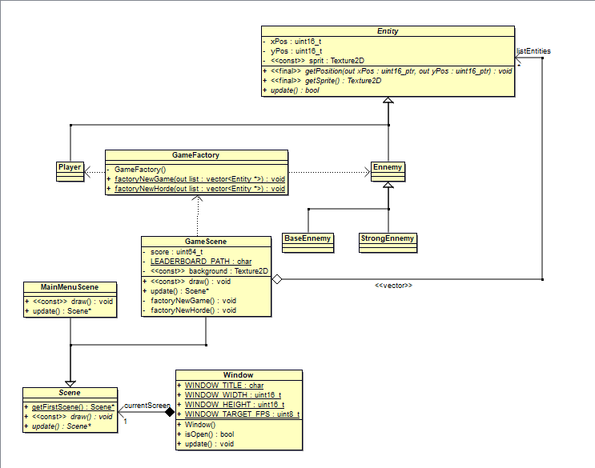
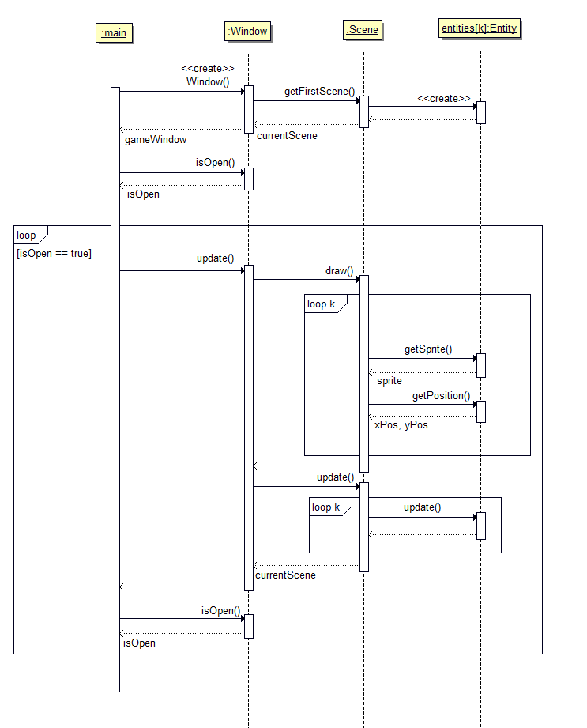

#Projet C++

##Présentation générale
Ce jeu est inspiré de Space Invaders. Vu du dessus, notre joueur doit tuer les ennemis qui arrivent par vagues. Il s'agit ici de zombies et de trolls.  
On a appelé notre jeu : **ZOMBIE WORLD**.

###Pour Jouer
* Passer du menu principal au jeu : ``ENTREE``
* Déplacer le joueur (clavier Azerty)
  * ``D`` ou ``->`` : A droite
  * ``Q`` ou ``<-`` : A gauche
* Tirer sur les ennemies : ``ESPACE``
* Quitter la partie : ``ECHAP``

###Illustration

***

##Développement
###Environnement
Nous avons utilisé l'IDE **Clion** de JetBrain, sur le système d'exploitation **Windows**.
  
###Contributeurs
* Lucas Pinard (lucasP243)
* Amélie Guédès (MelyMelo8)
* Alexander Mazeres (AlexMaze1210)
* Nicolas Dos Santos (Nicolas-dos6)

***
##Diagrammes UML
On a utilisé le logiciel Bouml pour faire ces diagrammes, par conséquent, il vaut mieux l'installer pour pouvoir ouvrir les fichiers de [UML-CppProject](UML-CppProject).

Ces diagrammes nous ont servi de base pour nos développements et pour la répartition des tâches.

###Diagramme de classes

###Diagramme de séquence
